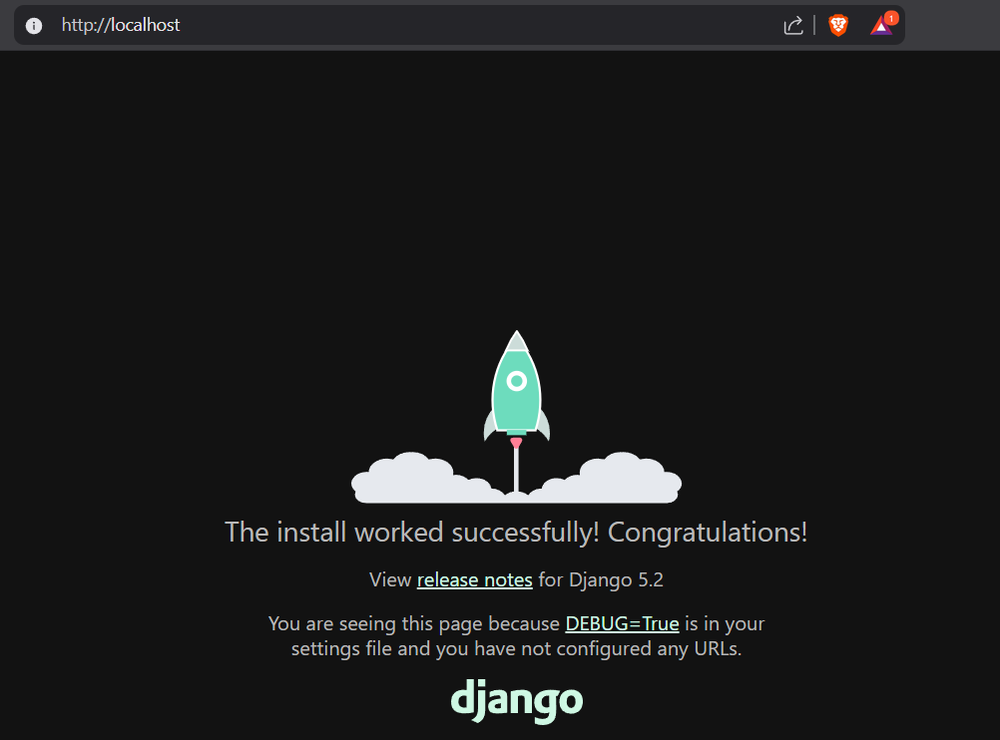
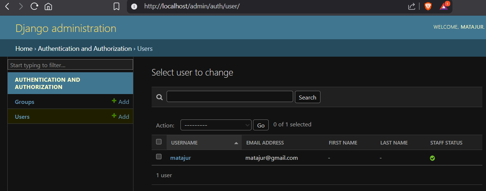
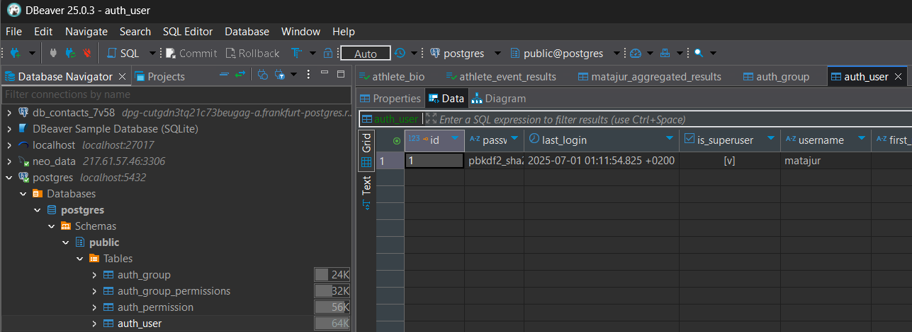

# Tier 4. Module 6 - DevOps CI/CD

## Homework for Topic 4 - Docker

### Technical task

This task will not only consolidate Docker's knowledge, but also prepare for the construction of complex infrastructures in future topics.

#### Task description

1. Create your own project that includes:

- **Django** - for a web application.
- **PostgreSQL** - for data storage.
- **Nginx** - for processing requests.

2. Use the Docker and Docker Compose to Containerization of All Services.

3. Upload the project into your repository on GitHub.

#### Steps to complete the task

1. **Create a Django project structure in Docker**

- Initialize the new Django project (the name of the project of your choice -> django-admin startproject my_project_name).
- Set up PostgreSQL as a database.
- Add Nginx to traffic proxy.

2. **Create Dockerfile for Django**

Your dockerfile should:

- Use the image of Python 3.9 or newer.
- Set all the necessary dependencies on **requirements.txt**.
- Run a Django server in a container.

3. **Create Docker-Compos.yml**

In **docker-compose.yml**, describe all three services:

- **web** is a Django application.
- **db** - PostgreSQL to save data.
- **nginx** is a web server for processing requests.

4. **Set up Nginx**

Create a **nginx.conf** file in a **nginx** folder with the following content:

```JS
server {
    listen 80;

    location / {
        proxy_pass <http://django:8000>;
        proxy_set_header Host $host;
        proxy_set_header X-Real-IP $remote_addr;
        proxy_set_header X-Forwarded-For $proxy_add_x_forwarded_for;
    }
}
```

5. **Test the project locally**

Start the project with the command:

- for the new image

```bash
docker-compose up --build
```

- for the existing image

```bash
docker-compose up -d
```

- to stop the project

```bash
docker-compose down
```

Apply migrations

```bash
docker-compose exec django python manage.py migrate
```

Create superuser
```bash
docker-compose exec django python manage.py createsuperuser
```

Make sure:

- Web project is available at http://localhost.



- connection to the PostgreSQL database works.






6. **Upload the project on GitHub**

- Create a new `lesson-4` branch in your repository.
- Download all the files of your project to the repository.
- Use the following commands to download changes:

```bash
git checkout -b lesson-4
git add .
git commit -m "Add Dockerized Django project with PostgreSQL and Nginx"
git push origin lesson-4
```

#### Acceptance criteria

1. Created the Django+Postgresql+nginx project in Docker.
2. All services are described in `docker-kompos.yml`.
3. Dockerfile for Django is configured according to the requirements above.
4. Nginx works as a web server to proximate requests.
5. The project is successfully launched locally by the `docker-comose up` command.
6. The project code is downloaded to the GitHub repository in the `lesson-4` branch.
